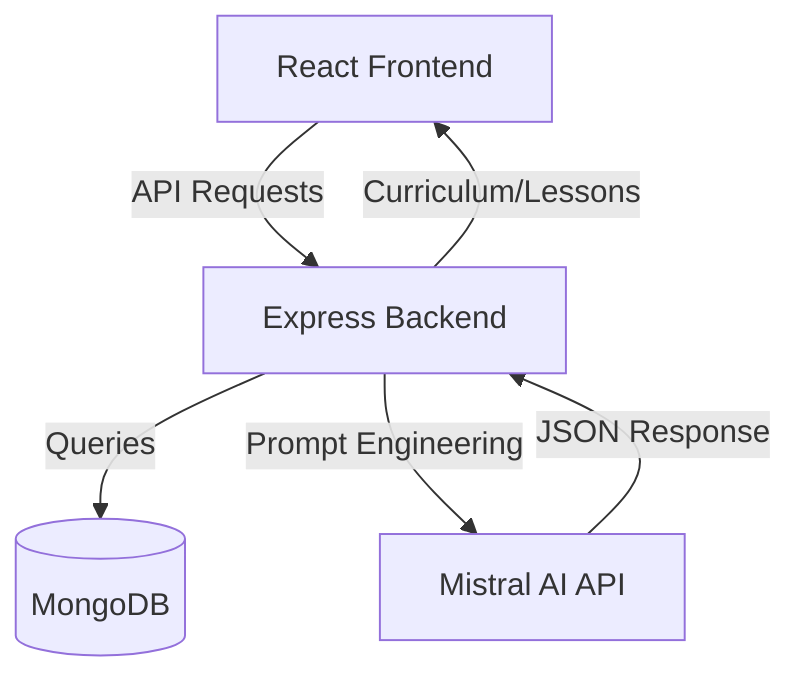

# SpeakEase Technical Documentation

Detailed breakdown of the SpeakEase architecture, technical stack, and development workflow.

---

## Architecture Overview

SpeakEase follows a modern MERN (MongoDB, Express, React, Node) architecture with a heavy focus on immersive frontend experiences and AI-driven content generation.

---

## Technical Stack

### Frontend Architecture
- **Framework**: React 18+ with Vite for ultra-fast development.
- **Styling**: Vanilla CSS with a global design system for maximum control over layouts.
- **Animations**: `framer-motion` for cinematic transitions and high-performance UI feedback.
- **Scrolling**: `lenis` for smooth, momentum-based scrolling.
- **Audio Engine**: Custom Web Audio API implementation for generative soundscapes and interface feedback.

### Backend Infrastructure
- **Runtime**: Node.js with Express.
- **Database**: MongoDB with Mongoose for structured yet flexible data modeling.
- **AI Integration**: Custom services for interacting with Mistral AI using strict JSON-schema prompting.
- **Auth**: Stateless JWT-based authentication with Google OAuth integration.

---

## AI Curriculum Engine

The core value of SpeakEase is its ability to generate curricula dynamically.

1. **Discovery**: When a user selects a language that lacks pre-seeded content, the `aiCurriculum` service is triggered.
2. **Prompting**: A heavily tuned system prompt is sent to Mistral (`mistral-large-latest`) requesting a full lesson structure including vocabulary, grammar notes, and a 5-question multi-modal quiz.
3. **Parsing**: The backend enforces `json_object` formatting to ensure the response is saved directly into the MongoDB collection.
4. **Seeding**: The content is logically ordered and delivered via the REST API.

---

## Project Structure

### Root
- `/client`: Frontend source code.
- `/server`: Backend API and database models.
- `package.json`: Main entry for concurrent development.

### Client Highlights
- `src/context`: Global state for Auth, Audio, and AI Mode.
- `src/services`: API wrappers and Mistral integration.
- `src/pages`: Cinematic page sequences (Landing, Dashboard, Quiz, etc.).

### Server Highlights
- `models/`: Mongoose schemas for Users, Languages, Lessons, and Quizzes.
- `routes/`: Express routers for authentication and content delivery.
- `services/`: Specialized logic for AI generations.

---

## Development Workflow

1. **Environment Setup**: Define secrets in local `.env` files (never pushed to GitHub).
2. **Concurrent Operation**: Run `npm run dev` at the root to start both Vite and Express.
3. **Deployment**: Build the frontend (`npm run build`) and serve static assets via the backend or a CDN in production.

---

## Security Best Practices

- **Zero-Key Leakage**: All API keys and secrets are exclusively loaded via environment variables.
- **Input Sanitization**: Mongoose provides built-in protection against common injection patterns.
- **Stateless Auth**: JWTs are used for secure, scalable authentication.
