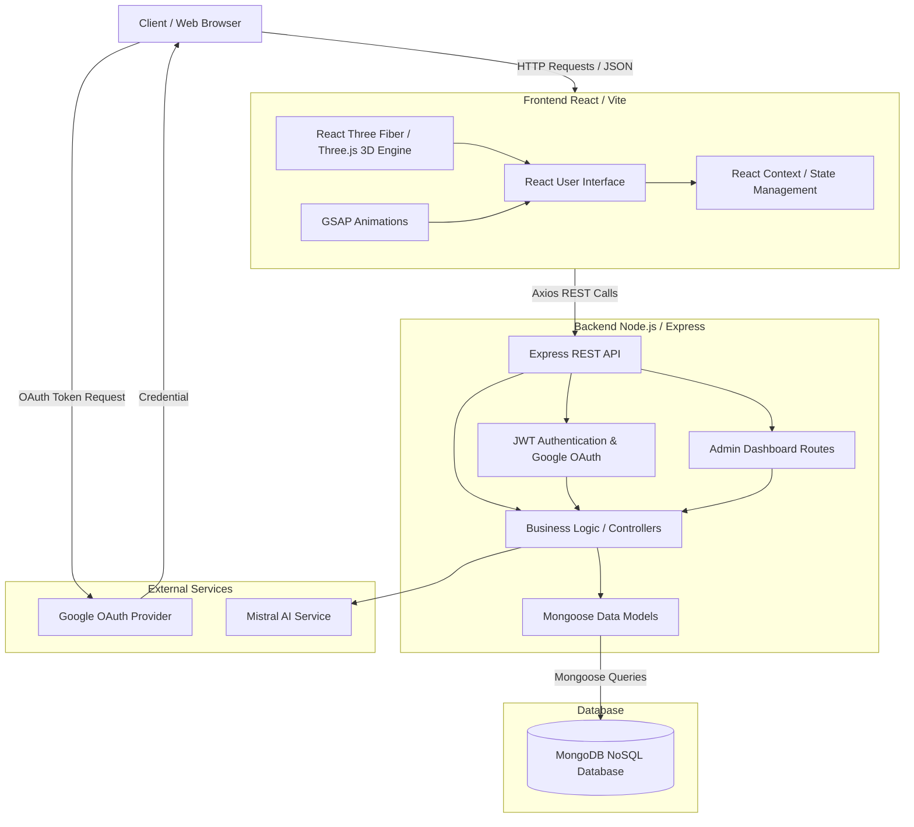
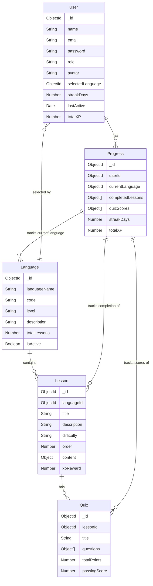

# SpeakEase Architecture and ER Diagram

## Project Architecture

The SpeakEase project follows a modern MERN (MongoDB, Express, React, Node.js) stack architecture augmented with WebGL for 3D rendering and Google OAuth 2.0 for seamless authentication.

### Architecture Description
1. **Frontend**: Built using React and Vite. It utilizes React Three Fiber for the 3D 'Neural Void' cinematic background and GSAP for fluid, hardware-accelerated animations. Google OAuth allows easy sign-in.
2. **Backend**: An Express.js REST API providing secure endpoints for user management, progression tracking, content delivery, and an Admin panel. It features standard JWT and Google OAuth authentication.
3. **External Services**: Uses Google's OAuth 2.0 system for login and integrates with Mistral AI for dynamic content generation.
4. **Database**: A MongoDB NoSQL database used to store flexible schemas for users, languages, structured lessons, and user progress.

## Entity-Relationship (ER) Diagram

The following ER diagram maps the data models used within the SpeakEase application.

### ER Diagram Description
- **User**: Stores authentication and profile data. Supports users created via standard email/password or Google OAuth (using a generated random password). Includes role-based access (`user` vs `admin`).
- **Language**: The core entity representing a language curriculum (e.g., Spanish, French). It contains multiple Lessons.
- **Lesson**: Structured learning content linked to a specific Language. Contains vocabulary and grammar notes.
- **Quiz**: Assessment content linked directly to a specific Lesson.
- **Progress**: A complex tracking entity that logs a User's completed lessons, quiz scores, earned XP, and activity timestamps to maintain streaks.
