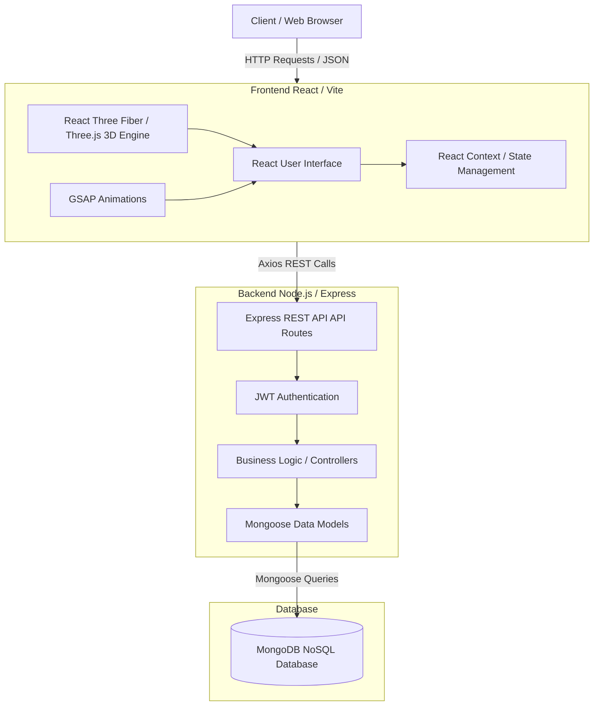
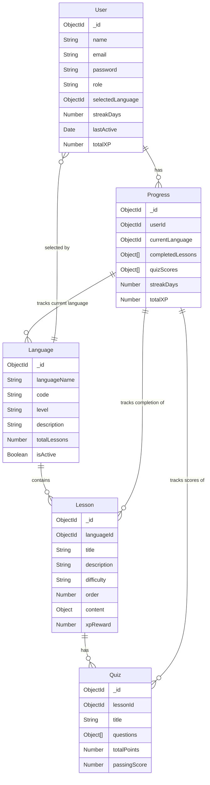

# SpeakEase Architecture and ER Diagram

## Project Architecture

The SpeakEase project follows a modern MERN (MongoDB, Express, React, Node.js) stack architecture augmented with WebGL for 3D rendering.

### Architecture Description
1. **Frontend**: Built using React and Vite. It utilizes React Three Fiber for the 3D 'Neural Void' cinematic background and GSAP for fluid, hardware-accelerated animations. 
2. **Backend**: An Express.js REST API providing secure endpoints for user management, progression tracking, and content delivery. It handles business logic, scoring, and user state.
3. **Database**: A MongoDB NoSQL database used to store flexible schemas for users, languages, structured lessons, and user progress. 

## Entity-Relationship (ER) Diagram

The following ER diagram maps the data models used within the SpeakEase application.

### ER Diagram Description
- **User**: Stores authentication and profile data, along with global XP and streak details. A user selects a default language.
- **Language**: The core entity representing a language curriculum (e.g., Spanish, French). It contains multiple Lessons.
- **Lesson**: Structured learning content linked to a specific Language. Contains vocabulary and grammar notes.
- **Quiz**: Assessment content linked directly to a specific Lesson.
- **Progress**: A complex tracking entity that logs a User's completed lessons, quiz scores, earned XP, and activity timestamps to maintain streaks.
