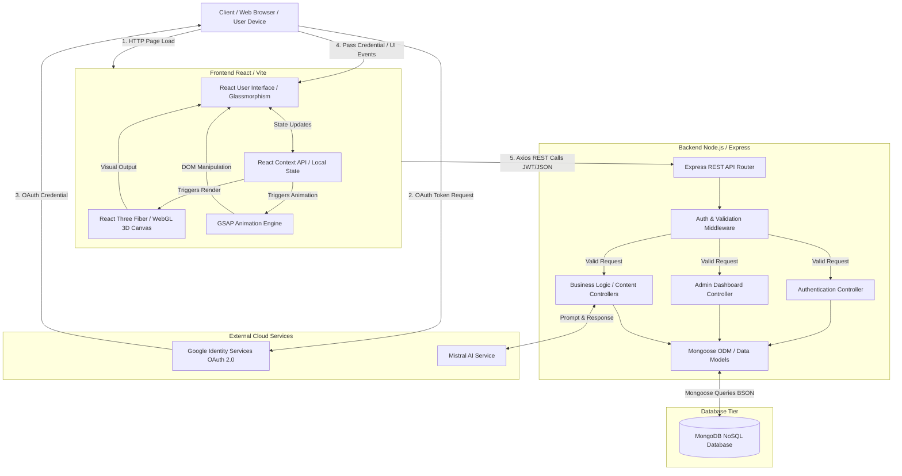
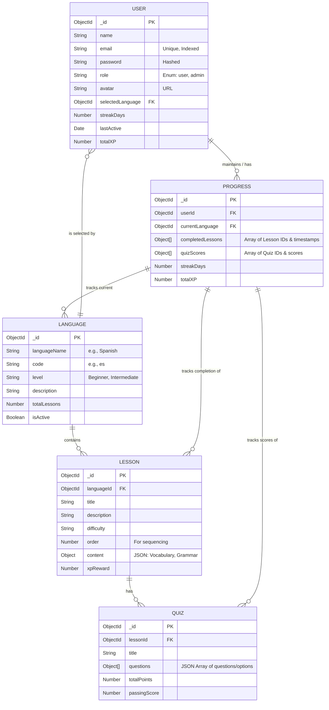
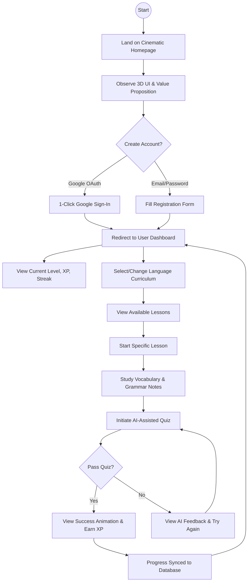
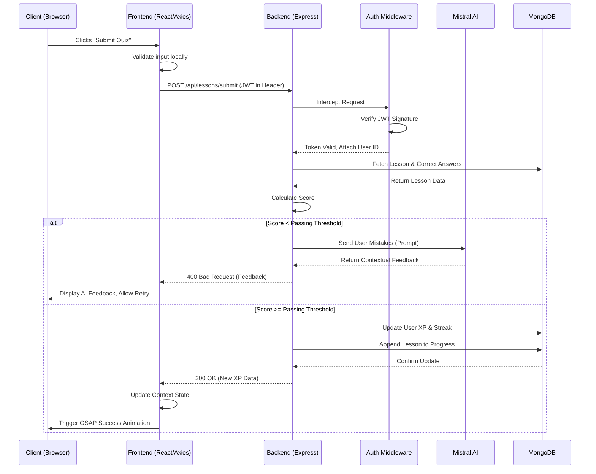

# SpeakEase: Immersive Language Learning Platform - Comprehensive Project Report

## 1. INTRODUCTION

The landscape of educational technology (EdTech) has undergone a massive transformation over the past decade, moving away from traditional, textbook-based methodologies toward interactive, digital ecosystems. Language learning, in particular, requires consistent engagement, contextual understanding, and immersive environments to simulate natural acquisition processes. However, a significant majority of contemporary language learning applications rely heavily on static, two-dimensional interfaces, repetitive multiple-choice questionnaires, and rigid curriculums that fail to adapt to the user's pace or interests. This often leads to high user attrition rates and cognitive fatigue.

**SpeakEase** represents a paradigm shift in digital language acquisition. It is an advanced, immersive language learning platform engineered to provide a highly interactive, cinematic, and personalized educational experience. By blending structured, comprehensive language curriculums across multiple global languages with an "Awwwards-level" 3D user interface, SpeakEase transforms language acquisition from a mundane chore into an engaging, gamified journey.

The core philosophy behind SpeakEase is **Visual Immersion and Seamless Flow**. The platform leverages cutting-edge web technologies, specifically WebGL, React Three Fiber, and customized GLSL fragment shaders, to create a captivating "Neural Void" environment. This environment reacts dynamically to user interactions, creating a sense of depth and focus that standard 2D web applications cannot achieve. 

Furthermore, SpeakEase integrates artificial intelligence, specifically the **Mistral AI** language model, to provide dynamic content generation, contextual grammar explanations, and adaptive quizzes. This ensures that the learning material remains fresh and highly relevant. To reduce friction and maximize user retention from the very first interaction, the platform implements **Google OAuth 2.0** for a seamless, secure, one-click authentication flow, bypassing the traditional hurdles of account creation.

In summary, SpeakEase is not just a language application; it is a holistic, technology-driven educational environment designed to maximize retention, accelerate fluency, and provide a visually stunning user experience.

---

## 2. PROBLEM STATEMENT

Despite the proliferation of language learning applications, the industry faces severe challenges regarding user retention and actual language acquisition efficiency. 

### 2.1 Industry Data and Current Gaps
Industry research and analytics indicate that **over 70% of users abandon language learning applications within the first 14 days of registration**. Furthermore, only a small fraction (less than 10%) of users who start a course actually complete it to a level of conversational fluency. The primary reasons for this high churn rate include:

1. **Cognitive Overload and Visual Fatigue**: Traditional apps utilize flat, 2D interfaces with repetitive layouts. Staring at static screens for extended periods causes visual fatigue and reduces the brain's ability to retain new vocabulary.
2. **Linear and Rigid Curriculums**: Most platforms force all users through the exact same linear path, regardless of their prior knowledge, learning speed, or specific interests. This rigidity leads to boredom for advanced learners and frustration for beginners.
3. **Friction in Onboarding**: Lengthy registration forms, email verifications, and complex password requirements create a significant barrier to entry. Many potential users drop off before even seeing the first lesson.
4. **Lack of Real-time Contextual AI**: Traditional applications rely on pre-programmed, static responses. If a user makes a mistake, they are often given a generic "Incorrect" prompt without a nuanced explanation of *why* they were wrong in that specific context.
5. **Ineffective Progression Mechanics**: While gamification (points, badges) exists, it is often superficially applied and disconnected from the core learning experience, failing to provide genuine, long-term motivation.

### 2.2 The SpeakEase Solution
SpeakEase systematically addresses these critical problems through the following innovations:

- **Combating Visual Fatigue with 3D Immersion**: By utilizing a WebGL-powered 3D background (the "Neural Void") and a glassmorphism UI driven by GSAP animations, SpeakEase provides a visually stimulating environment. The fluid motion and cinematic aesthetics keep the user visually engaged, reducing fatigue and making the learning process feel premium and dynamic.
- **AI-Powered Contextual Learning**: Through the integration of Mistral AI, SpeakEase provides dynamic content. Quizzes and conversational exercises are augmented by AI, allowing for nuanced explanations of grammar rules and personalized feedback tailored to the specific mistakes a user makes.
- **Frictionless 1-Click Onboarding**: By implementing Google Identity Services (OAuth 2.0), SpeakEase allows users to bypass tedious registration forms. A user can transition from the landing page to their first lesson in less than 3 seconds.
- **Instantaneous Gamification State Sync**: SpeakEase employs a robust progression system (XP, Streaks, Badges) that instantly synchronizes between the frontend React state and the backend MongoDB database. This immediate feedback loop triggers highly satisfying GSAP animations, reinforcing positive learning behaviors and encouraging daily return visits.

---

## 3. SOFTWARE REQUIREMENTS

To ensure the optimal development, deployment, and operation of the SpeakEase platform, a specific and modern software stack is required.

### 3.1 Frontend Stack
- **Framework**: React.js (v18.x or higher)
- **Build Tool**: Vite (for rapid HMR and optimized production bundling)
- **3D Rendering Engine**: Three.js combined with React Three Fiber (R3F)
- **Animation Engine**: GSAP (GreenSock Animation Platform) for high-performance, sequence-based UI animations.
- **Styling**: Tailwind CSS (for utility-first rapid UI development) or robust Vanilla CSS/SCSS modules for custom glassmorphism effects.
- **Routing**: React Router DOM (v6.x)
- **HTTP Client**: Axios (for communicating with the REST API)
- **Authentication**: `@react-oauth/google` for seamless Google Sign-In integration.

### 3.2 Backend Stack
- **Runtime Environment**: Node.js (v18.x LTS or higher)
- **Web Framework**: Express.js (v4.x)
- **Authentication/Security**: JSON Web Tokens (JWT), bcrypt.js (for manual password hashing), `google-auth-library` (for OAuth token verification).
- **Cross-Origin Resource Sharing**: `cors` middleware.
- **Environment Management**: `dotenv`

### 3.3 Database
- **DBMS**: MongoDB (NoSQL document database, v6.0 or higher)
- **ODM (Object Data Modeling)**: Mongoose (for schema validation, query building, and business logic encapsulation).

### 3.4 External APIs and Services
- **Artificial Intelligence**: Mistral AI API (used for dynamic prompt completion and grammar generation).
- **Identity Provider**: Google Cloud Console (OAuth 2.0 Client ID setup).

### 3.5 Development Tools
- **Version Control**: Git and GitHub/GitLab.
- **Package Managers**: npm or yarn.
- **IDE/Editor**: Visual Studio Code, WebStorm, or cursor.
- **API Testing**: Postman or Insomnia.

### 3.6 Target Client Environments
- **Operating Systems**: Windows 10/11, macOS 12+, Ubuntu 20.04+ (or equivalent Linux distros).
- **Web Browsers**: Modern browsers with WebGL 2.0 support (Google Chrome 90+, Mozilla Firefox 88+, Apple Safari 15+, Microsoft Edge 90+).

---

## 4. HARDWARE REQUIREMENTS

Because SpeakEase heavily utilizes real-time 3D rendering and complex shaders, the hardware requirements—particularly on the client side—are more stringent than a typical web application.

### 4.1 Client-Side Hardware (End User)
- **Processor (CPU)**: Minimum of an Intel Core i5 (8th Gen) or AMD Ryzen 5 (2nd Gen). Recommended: Intel Core i7 / AMD Ryzen 7 or Apple Silicon (M1/M2/M3).
- **Memory (RAM)**: Minimum 8 GB RAM. Recommended 16 GB RAM for smooth multitasking while the 3D canvas is active.
- **Storage**: Negligible (web-based application), but requires a minimum of 1 GB free disk space for browser caching and smooth operation.
- **Graphics Processing Unit (GPU) - CRITICAL**:
  - **Mandatory Requirement**: A dedicated GPU or a high-end integrated GPU is strictly required to ensure a stable 60 Frames Per Second (FPS) rendering of the WebGL canvas, GLSL shaders (Noise, Bloom, Vignette), and smooth cinematic 3D UI transitions.
  - **Supported Hardware**: NVIDIA GTX 1060 or higher, RTX series; AMD Radeon RX 570 or higher; Apple Silicon unified memory graphics.
  - *Note*: Running the application on low-end integrated graphics (e.g., older Intel HD graphics) may result in frame drops, latency, and a degraded user experience.
- **Display**: Minimum resolution of 1920x1080 (1080p). High-DPI (Retina) displays are recommended to fully appreciate the high-resolution textures and typography.
- **Network**: Broadband internet connection (Minimum 5 Mbps) to load 3D assets, audio files, and communicate with the AI APIs with minimal latency.

### 4.2 Server-Side Hardware (Deployment/Hosting)
- **Application Server (Node.js)**: 
  - Minimum 1 vCPU and 1 GB RAM (e.g., AWS t3.micro or equivalent on Render/Heroku).
  - Recommended: 2 vCPUs and 2-4 GB RAM for handling concurrent user requests and API proxying.
- **Database Server (MongoDB)**:
  - Can be hosted on MongoDB Atlas (Shared Cluster M0 is sufficient for development, M10+ recommended for production).
  - If self-hosted: Minimum 2 vCPUs, 4 GB RAM, and high-speed SSD storage.

---

## 5. PROJECT ARCHITECTURE

SpeakEase employs a robust, scalable MERN (MongoDB, Express, React, Node.js) stack architecture, significantly augmented with WebGL for 3D rendering and secure external API integrations.

### 5.1 Architecture Diagram



### 5.2 Highly Detailed Architecture Description

The architecture is divided into distinct, decoupled tiers to ensure scalability, maintainability, and high performance.

#### 5.2.1 The Client / Frontend Tier
The frontend is a Single Page Application (SPA) built with React and Vite. It is responsible for all user interactions, visual rendering, and local state management.
- **The React UI**: Acts as the skeleton of the application, rendering the glassmorphism components (panels, buttons, text) that overlay the 3D background.
- **React Three Fiber (WebGL)**: This is the engine behind the "Neural Void." R3F provides a declarative way to write Three.js code using React components. It manages the WebGL context, the camera, the scene graph, lighting, and custom GLSL fragment/vertex shaders. This layer is highly optimized to run on the GPU, offloading visual processing from the main thread.
- **GSAP Animation Engine**: While CSS transitions handle simple hovers, GSAP is used for complex, synchronized, and physics-based animations (e.g., page transitions, UI element staggering, XP gain popups). GSAP ensures animations are perfectly timed and hardware-accelerated.
- **State Management**: React Context API is used for global state (user profile, authentication status, current language), while local component state manages transient UI states (modals, form inputs).

#### 5.2.2 The Backend / API Tier
The backend serves as a secure RESTful API, acting as the intermediary between the frontend, the database, and external services.
- **Express Router & Middleware**: All incoming HTTP requests pass through middleware layers that handle CORS, JSON body parsing, and security headers. Custom middleware (`auth.js`) intercepts requests to protected routes, verifying the JWT token in the `Authorization` header.
- **Controllers**: The application logic is compartmentalized into specific controllers:
  - *Auth Controller*: Handles registration, login, and Google OAuth credential verification. It issues JWTs.
  - *Lesson & Quiz Controllers*: Fetches structured curriculum data and processes quiz submissions.
  - *Admin Controller*: Provides endpoints for aggregating platform statistics (total users, active users, language popularity) restricted to users with the 'admin' role.
- **External API Integration**: The backend securely holds the API keys for Mistral AI. When a user requests an AI-generated quiz, the backend constructs a prompt, sends it to Mistral, parses the response, and serves it back to the client. This prevents exposing API keys on the frontend.

#### 5.2.3 The Database Tier
- **MongoDB & Mongoose**: MongoDB stores data in flexible, JSON-like BSON documents. Mongoose acts as the Object Data Modeling (ODM) layer, providing strict schema validation (ensuring required fields are present, enforcing data types), query building, and relationship mapping between documents.

---

## 6. ENTITY-RELATIONSHIP (ER) DIAGRAM

The SpeakEase database schema is designed for high read performance (delivering lessons quickly) and transactional integrity when updating user progress.

### 6.1 ER Diagram



### 6.2 Highly Detailed Schema Description

1. **USER Entity**: The central entity representing a person using the platform.
   - It stores authentication credentials (`email`, hashed `password`). For Google OAuth users, a strong randomized string acts as a placeholder password.
   - `role` distinguishes between standard learners and platform administrators.
   - It contains high-level, frequently accessed gamification data (`totalXP`, `streakDays`, `lastActive`) to allow the frontend dashboard to load quickly without requiring complex joins.
   - `selectedLanguage` acts as a Foreign Key to remember the user's current focus.

2. **LANGUAGE Entity**: Represents a top-level curriculum offering (e.g., "Spanish - Beginner").
   - Contains metadata about the course (`languageName`, `code`, `description`).
   - `isActive` allows administrators to soft-delete or hide languages that are currently under development.

3. **LESSON Entity**: The core educational unit.
   - Linked to a specific Language via `languageId`.
   - The `content` field is a flexible JSON object that stores arrays of vocabulary words, translations, and markdown-formatted grammar rules.
   - `order` ensures lessons are presented sequentially.
   - `xpReward` defines how many experience points the user gains upon completion.

4. **QUIZ Entity**: Represents an assessment tied to a specific lesson.
   - Linked via `lessonId`.
   - The `questions` array contains objects with the question text, an array of options, and the index of the correct answer.
   - `passingScore` determines the threshold required to mark the associated lesson as "completed."

5. **PROGRESS Entity**: A complex tracking entity that isolates progression data from the base user profile.
   - Linked to `userId`.
   - Maintains an array of `completedLessons`. When a user passes a quiz, the lesson ID and completion timestamp are pushed here.
   - Maintains an array of `quizScores` to track performance over time.
   - Duplicates `totalXP` and `streakDays` for auditing and complex aggregations.

---

## 7. ROLES AND RESPONSIBILITIES

The development and deployment of SpeakEase require a coordinated effort across various technical and design disciplines. Below is a detailed breakdown of the roles and their responsibilities.

### 7.1 Project Manager / Scrum Master
- **Responsibilities**: Oversees the entire software development lifecycle (SDLC). Facilitates sprint planning, daily stand-ups, and retrospective meetings.
- **Tasks**:
  - Translates business requirements into actionable Jira/Trello tickets.
  - Manages the project timeline, ensuring milestones (Alpha, Beta, Production) are met.
  - Acts as the primary liaison between stakeholders and the development team.
  - Identifies and mitigates project risks and blockers.

### 7.2 Lead Frontend Developer (UI/WebGL)
- **Responsibilities**: Architects the React application, builds the 3D environments, and ensures a buttery-smooth 60fps cinematic experience.
- **Tasks**:
  - Develops reusable React components implementing the glassmorphism design system.
  - Programs WebGL scenes using React Three Fiber, manipulating meshes, materials, and lighting.
  - Writes custom GLSL shaders for the "Neural Void" background effects.
  - Implements complex GSAP timelines for page transitions and UI choreography.
  - Integrates the Google OAuth SDK on the client side.

### 7.3 Backend / API Developer
- **Responsibilities**: Constructs the secure, scalable Node.js/Express architecture and designs the MongoDB database schemas.
- **Tasks**:
  - Develops RESTful API endpoints for user management, lesson retrieval, and progress updates.
  - Implements secure authentication flows using JWT and verifies Google OAuth tokens.
  - Integrates the Mistral AI API, crafting robust prompts for dynamic quiz generation.
  - Writes Mongoose models, ensuring strict data validation and efficient querying.
  - Secures the application against common vulnerabilities (XSS, CSRF, NoSQL Injection).

### 7.4 UI/UX Designer
- **Responsibilities**: Crafts the visual identity, user journey, and wireframes of the application.
- **Tasks**:
  - Designs high-fidelity prototypes in Figma, focusing on modern aesthetics (dark modes, vibrant gradients, glassmorphism).
  - Establishes a cohesive design system (typography, color palettes, spacing).
  - Conducts user flow analysis to ensure onboarding and navigation are intuitive.
  - Prepares 3D assets or references for the frontend developer to implement in WebGL.

### 7.5 Quality Assurance (QA) Engineer / Tester
- **Responsibilities**: Ensures the application is bug-free, performant, and meets all requirements.
- **Tasks**:
  - Writes and executes manual test cases for all user flows (authentication, learning, admin).
  - Performs performance testing, specifically monitoring GPU/CPU load caused by the WebGL canvas.
  - Tests the application across different browsers (Chrome, Safari, Firefox) and operating systems.
  - Verifies API endpoint security and validates edge cases (e.g., submitting quizzes with missing data).

---

## 8. CUSTOMER FLOW

The Customer Flow maps the exact journey a user takes from their first interaction with the application to becoming an engaged, active learner.

### 8.1 Customer Flow Diagram



### 8.2 Detailed Step-by-Step Customer Flow

1. **The Hook (Landing Page)**: The user visits the SpeakEase URL. They are immediately greeted by the "Neural Void" 3D background—a swirling, dynamic visual that establishes a premium feel. The value proposition is presented clearly via glassmorphic UI cards.
2. **Frictionless Onboarding**: The user clicks "Get Started". Instead of a daunting form, they are presented with a "Continue with Google" button. Clicking this triggers the Google OAuth popup. The user selects their Google account, and within seconds, they are authenticated.
3. **The Command Center (Dashboard)**: The user is routed to their personalized dashboard. Here, they see a visually appealing summary of their journey: Total XP, Current Day Streak, and their active language.
4. **Curriculum Selection**: If it's their first time, they browse the available languages (e.g., Spanish, French, Japanese) represented by interactive 3D cards. They select a language, which updates their profile in the database.
5. **The Learning Loop**: 
   - The user clicks on the first unlocked Lesson.
   - They enter the Lesson Interface, where vocabulary and grammar rules are presented beautifully. The 3D background subtly shifts colors to indicate a change in context.
   - After reviewing the material, they click "Take Quiz".
6. **Assessment and AI Interaction**: The user answers a series of questions. If they struggle, they can request a hint powered by Mistral AI, which provides contextual help without giving away the direct answer.
7. **Reward and Progression**: Upon passing the quiz, a highly satisfying GSAP animation plays—numbers count up rapidly, a badge pulses, and XP is awarded. The database is updated, unlocking the next lesson. The user returns to the dashboard, motivated to continue their streak the next day.

---

## 9. SYSTEM FLOW

The System Flow details the technical lifecycle of data and requests moving through the platform's architecture.

### 9.1 System Flow Diagram



### 9.2 Detailed Technical System Flow

1. **Action Initiation**: The user interacts with the React UI (e.g., clicking "Submit Quiz"). The component's local state gathers the user's selected answers.
2. **Frontend Validation and Dispatch**: React performs basic validation to ensure no questions were left blank. It then uses Axios to construct a POST request. Critically, it attaches the user's JWT from `localStorage` into the `Authorization: Bearer <token>` header.
3. **Backend Interception**: The Express server receives the request at the `/api/lessons/submit` endpoint. Before reaching the controller, the request passes through the `auth` middleware.
4. **Authentication and Authorization**: The middleware extracts the JWT and verifies its cryptographic signature using the `JWT_SECRET`. If valid, it decodes the token, extracts the `userId`, attaches it to the `req` object, and calls `next()`.
5. **Business Logic Processing**: The specific Express controller takes over. It queries MongoDB for the correct answers for that specific quiz ID. It compares the user's payload against the correct answers and calculates a score.
6. **AI Integration (Conditional)**: If the user failed, the controller constructs a prompt containing the user's wrong answers and sends a secure, server-to-server request to the Mistral AI API. Mistral generates an explanation, which the backend forwards to the frontend.
7. **Database Transaction (Success)**: If the user passed, the controller initiates a sequence of database updates: it pushes the lesson ID to the user's `completedLessons` array, increments `totalXP`, and updates `streakDays`. 
8. **Response and Re-render**: The backend responds with a `200 OK` status and the updated user profile JSON. The frontend Axios promise resolves, React Context is updated with the new data, triggering a re-render and firing the GSAP success animations.

---

## 10. MVC PATTERN

SpeakEase implements the Model-View-Controller (MVC) architectural pattern. This separation of concerns makes the codebase highly organized, testable, and scalable.

### 10.1 MVC Diagram

```mermaid
graph LR
    subgraph Client Environment
        View[View / Frontend]
        note1(React Components<br/>Three.js Canvas<br/>Tailwind CSS)
        View --- note1
    end

    subgraph Node.js Server Environment
        Controller[Controller / Backend Logic]
        note2(Express Routes<br/>Middleware<br/>Business Logic Functions)
        Controller --- note2

        Model[Model / Database Schema]
        note3(Mongoose Schemas<br/>Data Validation<br/>Query Definitions)
        Model --- note3
    end

    User((User)) -->|Interacts (Clicks, Types)| View
    View -->|1. HTTP Request (JSON)| Controller
    Controller -->|2. CRUD Operations (BSON)| Model
    Model -->|3. Data Results| Controller
    Controller -->|4. HTTP Response (JSON)| View
    View -->|Updates Display| User
```

### 10.2 Highly Detailed MVC Description

#### 10.2.1 Model (The Data Layer)
Located primarily in the `server/models/` directory, the Models define the shape, constraints, and relationships of the data. SpeakEase uses Mongoose to define these schemas.
- **Responsibility**: Directly interacts with the MongoDB database. It is entirely agnostic of the user interface or how the data is routed.
- **Implementation**: The `User.js` model, for example, dictates that an `email` must be a string, must be unique, and must match a specific regex pattern. It also contains pre-save hooks (e.g., automatically hashing a password before it is saved to the database using `bcrypt`).

#### 10.2.2 View (The Presentation Layer)
Located entirely within the `client/` directory, the View represents the user interface.
- **Responsibility**: Renders data to the screen, captures user input, and manages the visual state of the application. It knows nothing about how the database works; it only knows how to consume JSON from an API.
- **Implementation**: In SpeakEase, the View is exceptionally complex, comprising React components (`Dashboard.jsx`), 3D canvases managed by React Three Fiber (`Background.jsx`), and animation logic powered by GSAP. When the View needs data, it dispatches an action via Axios to the Controller.

#### 10.2.3 Controller (The Logic Layer)
Located in `server/controllers/` and `server/routes/`, the Controller acts as the brain connecting the View and the Model.
- **Responsibility**: Receives HTTP requests from the View, parses the input, enforces business rules, interacts with the relevant Models, and formulates an HTTP response.
- **Implementation**: An `authController.js` file handles a login request. It takes the email/password from the request body, asks the `User` model to find a user with that email, checks the password hash, and if successful, generates a JWT and sends it back to the View.

---

## 11. DIRECTORY STRUCTURE

A well-structured project directory is critical for maintainability and onboarding new developers. SpeakEase is organized as a monorepo containing both the client and server codebases.

### 11.1 Project Tree Structure

```text
speakease/
│
├── client/                     # Frontend React Application
│   ├── public/                 # Static assets (fonts, raw 3D models, textures)
│   ├── src/
│   │   ├── assets/             # CSS files, images used in components
│   │   ├── components/         # Reusable React components (Buttons, Cards, Navbars)
│   │   ├── contexts/           # React Context providers (AuthContext)
│   │   ├── hooks/              # Custom React hooks (useAuth, useThree)
│   │   ├── pages/              # Top-level route components (Home, Dashboard, Lesson)
│   │   ├── shaders/            # Custom GLSL code (.glsl files) for WebGL
│   │   ├── utils/              # Helper functions (Axios instances, formatting)
│   │   ├── App.jsx             # Main application component & Router configuration
│   │   └── main.jsx            # React DOM entry point
│   ├── .env                    # Frontend environment variables
│   ├── package.json            # Frontend dependencies
│   ├── tailwind.config.js      # Tailwind styling configuration
│   └── vite.config.js          # Vite build configuration
│
├── server/                     # Backend Node/Express Application
│   ├── controllers/            # Business logic handlers (auth.js, lesson.js)
│   ├── middleware/             # Express middleware (auth.js for JWT verification)
│   ├── models/                 # Mongoose database schemas (User.js, Progress.js)
│   ├── routes/                 # Express route definitions pointing to controllers
│   ├── scripts/                # Database seeding scripts (seed.js)
│   ├── utils/                  # Helper functions (token generation, AI API callers)
│   ├── .env                    # Backend environment variables (Secrets, DB URI)
│   ├── package.json            # Backend dependencies
│   └── server.js               # Entry point, Express app initialization, DB connection
│
├── .gitignore                  # Git ignore rules
├── README.md                   # Main project documentation
└── report.md                   # This comprehensive project report
```

### 11.2 Directory Description
- **`client/src/components/`**: Houses small, reusable UI building blocks. Ensures DRY (Don't Repeat Yourself) principles.
- **`client/src/pages/`**: Contains the main views associated with specific URLs (e.g., `/dashboard`). These components assemble the smaller building blocks from `components/`.
- **`client/src/shaders/`**: A highly specialized folder containing C-like GLSL code executed directly on the GPU to create the "Neural Void" effects.
- **`server/models/`**: The single source of truth for data structure. If a new field needs to be added to a User, it happens here.
- **`server/routes/`**: Acts as a traffic cop, mapping URL endpoints (e.g., `POST /api/login`) to the specific function in `server/controllers/` that should handle it.

---

## 12. TECH STACK IN DETAIL

Choosing the right technology stack is paramount. The MERN stack + WebGL was chosen specifically to balance rapid development with high-end visual performance.

### 12.1 Frontend Technologies
- **React 18**: The foundational UI library. Its virtual DOM ensures fast updates. React 18's concurrent rendering features help keep the UI responsive even when the WebGL canvas is performing heavy computations.
- **Vite**: Replaced Create React App. Vite provides near-instantaneous Hot Module Replacement (HMR) during development, which is crucial when tweaking complex 3D shaders or GSAP animations, saving hours of developer time.
- **Three.js & React Three Fiber (R3F)**: Three.js is the industry-standard 3D library for the web. R3F wraps Three.js into React components, allowing developers to manage 3D objects using the same declarative syntax and state management rules as standard HTML elements. This bridges the gap between web development and game engine graphics.
- **GSAP (GreenSock Animation Platform)**: Selected over CSS animations or Framer Motion for its sheer performance and sequencing capabilities. GSAP can animate thousands of DOM elements or WebGL properties concurrently without dropping frames, essential for the cinematic "wow" factor of SpeakEase.
- **Tailwind CSS**: A utility-first CSS framework. It allows for rapid styling directly within JSX, ensuring consistency in spacing, colors, and typography without the cognitive overhead of maintaining large, separate CSS files.

### 12.2 Backend Technologies
- **Node.js**: The Javascript runtime. Utilizing Node.js allows the entire stack (frontend and backend) to be written in JavaScript, streamlining development and allowing code sharing (like validation logic) between client and server.
- **Express.js**: A minimalist web framework for Node.js. It provides a robust set of features for web and mobile applications, specifically its powerful routing and middleware architecture, which makes building RESTful APIs straightforward.
- **JSON Web Tokens (JWT)**: Used for stateless authentication. Instead of storing session IDs in the database, the server signs a cryptographic token containing the user's ID. This token is stored on the client and sent with every request, allowing the server to verify the user without a database lookup, drastically improving API response times.

### 12.3 Database and External Services
- **MongoDB & Mongoose**: MongoDB's document-oriented nature perfectly matches the JSON format used by the Node.js backend and React frontend. Mongoose provides necessary structure (schemas) over MongoDB's inherent flexibility, preventing bad data from entering the system.
- **Mistral AI**: Chosen for its high performance and cost-effectiveness compared to other LLMs. Mistral provides the cognitive engine necessary for generating dynamic, context-aware language quizzes and personalized grammar feedback.
- **Google Identity Services (OAuth 2.0)**: Provides the 1-click login functionality. It offloads the burden of secure password management and email verification to Google, providing a smoother user experience and higher security.

---

## 13. INSTALLATION GUIDE

This section provides a rigorous, step-by-step guide to setting up SpeakEase in a local development environment.

### 13.1 Prerequisites Installation
Before beginning, ensure your system has the following installed:
1. **Node.js**: Download and install v18.x LTS from `nodejs.org`. Verify installation by running `node -v` in your terminal.
2. **Git**: Download from `git-scm.com`. Verify with `git --version`.
3. **MongoDB**: You can install MongoDB Community Server locally, or set up a free shared cluster on MongoDB Atlas (`mongodb.com/atlas`).

### 13.2 Acquiring API Keys
1. **Mistral AI**: Create an account on the Mistral developer platform, navigate to API Keys, and generate a new key.
2. **Google OAuth**: 
   - Go to the Google Cloud Console.
   - Create a new project.
   - Navigate to "APIs & Services" > "Credentials".
   - Create OAuth client ID (Web application type). Set Authorized JavaScript origins to `http://localhost:5173`.
   - Copy the Client ID.

### 13.3 Project Setup & Cloning
Open a terminal and execute the following:
```bash
# Clone the repository
git clone https://github.com/yourusername/speakease.git

# Navigate into the project directory
cd speakease
```

### 13.4 Backend Configuration
1. Navigate to the server directory:
   ```bash
   cd server
   ```
2. Install Node dependencies:
   ```bash
   npm install
   ```
3. Create the environment variables file:
   ```bash
   touch .env
   ```
4. Open the `.env` file in your editor and populate it with your credentials:
   ```env
   PORT=5000
   MONGO_URI=mongodb://localhost:27017/speakease  # Or your Atlas connection string
   JWT_SECRET=generate_a_long_random_string_here_for_security
   MISTRAL_API_KEY=your_mistral_api_key_here
   GOOGLE_CLIENT_ID=your_google_oauth_client_id_here
   ```
5. Seed the database with initial languages and curriculums:
   ```bash
   node scripts/seed.js
   node scripts/add100Languages.js
   node scripts/addExpandedLessons.js
   ```
6. Start the backend server in development mode:
   ```bash
   npm run dev
   # Terminal should output: "Server running on port 5000" and "MongoDB Connected"
   ```

### 13.5 Frontend Configuration
1. Open a *new* terminal window/tab and navigate to the client directory:
   ```bash
   cd speakease/client
   ```
2. Install Node dependencies:
   ```bash
   npm install
   ```
3. Create the environment variables file:
   ```bash
   touch .env
   ```
4. Open the `.env` file and populate it (Note the `VITE_` prefix required by Vite):
   ```env
   VITE_API_URL=http://localhost:5000/api
   VITE_GOOGLE_CLIENT_ID=your_google_oauth_client_id_here
   ```
5. Start the frontend development server:
   ```bash
   npm run dev
   # Terminal should output a local network address, typically http://localhost:5173
   ```

### 13.6 Verification
Open your modern web browser (e.g., Google Chrome) and navigate to `http://localhost:5173`. You should see the cinematic 3D landing page and be able to interact with the platform.

---

## 14. PROJECT SNAPSHOTS

*(Note: In a live markdown viewer with access to the assets folder, these would render as high-resolution images. Below are detailed descriptions of the key visual interfaces.)*

**Snapshot 1: The Cinematic Landing Page**
``
*Description*: The landing page features the "Neural Void" background—a deep, swirling, galaxy-like WebGL shader that slowly rotates. Overlaying this are frosted-glass UI panels (glassmorphism) containing the SpeakEase logo, a strong value proposition ("Master Languages Immersively"), and a prominent "Continue with Google" OAuth button. The design uses a dark-mode aesthetic with vibrant neon blue and purple accents.

**Snapshot 2: The User Dashboard**
``
*Description*: Upon logging in, the user sees a clean, grid-based dashboard. The top section displays an animated XP counter and a fire icon indicating the current daily streak. Below, interactive 3D cards represent different language courses. Hovering over a card triggers a GSAP animation where the card tilts slightly based on mouse position.

**Snapshot 3: The Learning Interface**
``
*Description*: Inside a lesson, the 3D background dims to reduce distraction. The content is presented in centered, easy-to-read typography. Vocabulary words appear with staggered fade-in animations. A floating "Ask AI" button sits in the corner, allowing the user to request dynamic grammatical explanations.

**Snapshot 4: The Admin Panel**
``
*Description*: Restricted to users with the 'admin' role. This dashboard features data visualization components (charts and graphs) tracking daily active users, total platform XP generated, and a breakdown of the most popular languages being studied. It uses a highly functional, tabular layout.

---

## 15. CONCLUSION AND FUTURE SCOPE

SpeakEase successfully demonstrates that the integration of high-end web graphics (WebGL, React Three Fiber), seamless authentication (Google OAuth), and advanced Artificial Intelligence (Mistral AI) can fundamentally disrupt the traditional e-learning paradigm. By prioritizing visual immersion and frictionless user flows, SpeakEase significantly mitigates the high churn rates that plague conventional language applications.

### 15.1 Future Enhancements
While the current version of SpeakEase is robust and feature-rich, the architecture has been specifically designed to accommodate future scaling and feature additions:

1. **Voice Recognition Integration**: Implementing the Web Speech API to allow users to practice pronunciation. The AI backend would analyze the audio input and provide real-time phonetic feedback.
2. **Multiplayer and Social Features**: Introducing a 'Friends' system and global leaderboards to enhance the competitive gamification aspect. Future updates could include synchronous AI-moderated voice chat rooms for advanced learners to practice together.
3. **Mobile Application**: Utilizing React Native to port the core logic and UI paradigms to iOS and Android natively, extending the platform's reach beyond desktop browsers.
4. **Expanded AI Capabilities**: Upgrading the Mistral integration to support real-time, branching conversational simulations where the user roleplays scenarios (e.g., ordering food in a Parisian cafe) directly with an AI avatar.

SpeakEase is not merely a project; it is a foundational platform built for the future of interactive, digital education.
