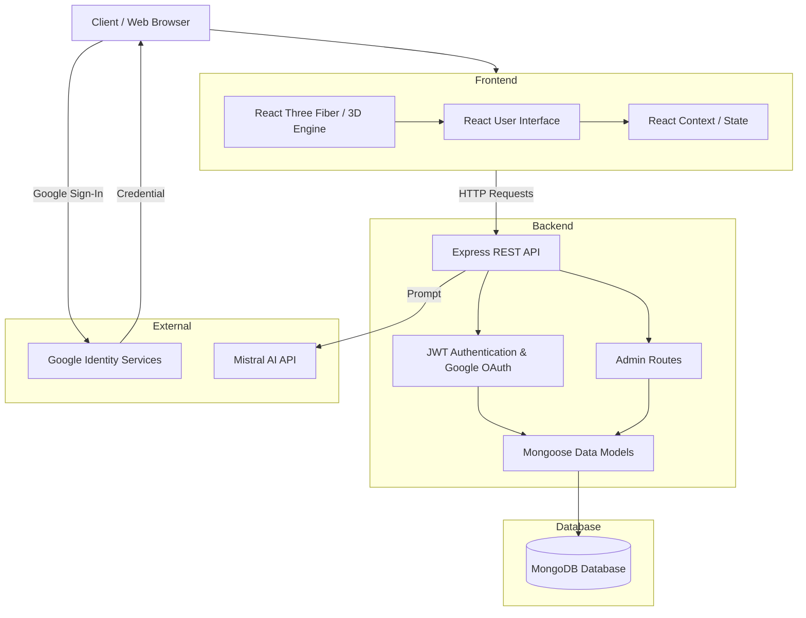
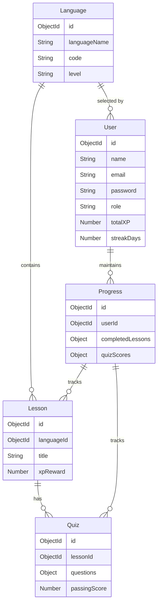
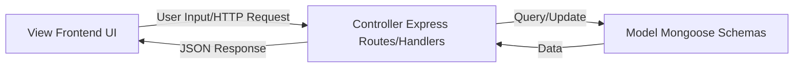

# SpeakEase Project Report

## 1. Introduction
SpeakEase is an advanced, immersive language learning platform designed to provide a highly interactive and cinematic educational experience. By blending structured language curriculums across multiple global languages with an "Awwwards-level" 3D user interface, SpeakEase transforms language acquisition from a traditional, static process into an engaging, gamified journey. The platform leverages WebGL, React Three Fiber, and customized GLSL fragment shaders to create a "Neural Void" environment. Furthermore, it integrates Mistral AI for dynamic content generation and Google OAuth 2.0 for a seamless, secure authentication flow.

## 2. Problem Statement
Traditional language learning applications often suffer from static interfaces, repetitive user experiences, and a lack of visual engagement, leading to high user drop-off rates and decreased motivation. Furthermore, many existing platforms fail to integrate seamless progression tracking with a modern aesthetic that appeals to visually-oriented learners, and often force cumbersome registration processes.

SpeakEase addresses these issues by:
- Eliminating mundane UI layouts and replacing them with a fluid, 3D-accelerated environment.
- Providing structured, authentic curriculums alongside AI-powered content via Mistral AI.
- Offering 1-click Google OAuth authentication to remove onboarding friction.
- Implementing a robust progression system (XP, Streaks, Badges) that instantly synchronizes between the frontend state and the backend database.
- Equipping platform administrators with a dedicated Admin Dashboard to track global user engagement and statistics.

## 3. Software Requirements
- **Frontend Stack**: React 18, Vite, Three.js, React Three Fiber, GSAP (GreenSock Animation Platform), Tailwind CSS (or Custom Vanilla CSS), Axios, Google Identity Services.
- **Backend Stack**: Node.js, Express.js, `google-auth-library`.
- **Database**: MongoDB (NoSQL) with Mongoose ODM.
- **External APIs**: Mistral AI API for dynamic learning assistance.
- **Tools**: Git, npm/yarn, modern web browser (Chrome, Firefox, Safari, Edge).

## 4. Hardware Requirements
- **Processor**: Intel Core i5 or AMD Ryzen 5 (or equivalent) minimum.
- **Memory**: 8 GB RAM minimum (16 GB recommended for development).
- **Storage**: 1 GB of available disk space.
- **Graphics/GPU**: **A mandatory dedicated GPU** (e.g., NVIDIA GTX/RTX series, AMD Radeon RX series, or Apple Silicon unified memory) is strictly required to ensure 60fps rendering of the WebGL canvas, GLSL shaders, and smooth cinematic 3D UI transitions.
- **Display**: Minimum resolution of 1080p.

## 5. Project Architecture Diagram
The platform uses a MERN stack architecture integrated with WebGL rendering, OAuth 2.0, and external AI services.



### Architecture Description
The client accesses the React-based frontend, which uses React Three Fiber to render the heavy 3D background components. The UI communicates via Axios with the Express backend. Authentication is handled either via standard JWT logic or through Google OAuth. The backend processes business logic, communicates with Mistral AI for dynamic learning features, and queries the MongoDB database using Mongoose models. An Admin-only routing layer allows platform administrators to query analytics.

## 6. Entity-Relationship (ER) Diagram



### ER Diagram Description
- **User**: Stores account details, role (`user` vs `admin`), global stats, and OAuth configurations.
- **Language**: Represents the curriculum for a specific language.
- **Lesson**: Holds the educational content (vocabulary, grammar).
- **Quiz**: Contains assessment questions tied to a lesson.
- **Progress**: A transactional tracking model that logs user completions and scores.

## 7. Features
- **Cinematic 3D Interface**: Immersive WebGL backgrounds with GSAP-driven glassmorphism UI and advanced post-processing (Bloom, Noise, Vignette).
- **Frictionless Onboarding**: 1-click Google OAuth 2.0 integration alongside standard email registration.
- **AI-Powered Curriculum**: Integration with Mistral AI to power dynamic quizzes and conversations.
- **Structured Curriculum**: 10+ supported languages with dedicated Beginner, Intermediate, and Advanced tiers.
- **Gamified Progression**: Real-time XP tracking, daily streaks, and achievement badges.
- **Admin Dashboard**: Secure administrative endpoints for tracking user statistics and managing content.

## 8. Roles and Responsibility
- **Project Manager**: Oversees timeline, task distribution, and ensures project goals are met.
- **Frontend Developer**: Develops the React components, integrates Google Identity Services, creates GSAP animations, and builds the 3D WebGL scenes using React Three Fiber.
- **Backend Developer**: Constructs the Express API, implements JWT/OAuth authentication logic, integrates the Mistral AI API, and designs MongoDB schemas.
- **UI/UX Designer**: Crafts the glassmorphism aesthetic, color palettes, and ensures the cinematic feel of the application.
- **QA/Tester**: Identifies performance bottlenecks, verifies API response integrity, and ensures the UI runs at 60fps on dedicated GPUs.

## 9. Client and Stakeholders
- **Target Audience**: Students, professionals, and language enthusiasts seeking a modern, engaging learning platform.
- **Stakeholders**: Educational content creators, investors focused on EdTech, and the internal development team.

## 10. User Flow
1. **Landing Page**: User lands on the cinematic 3D homepage.
2. **Authentication**: User logs in via Google OAuth or registers a new account manually.
3. **Dashboard**: User views current streak, total XP, and available language courses.
4. **Course Selection**: User selects a language to learn.
5. **Lesson Interface**: User studies vocabulary and grammar notes within the interactive UI.
6. **Quiz Assessment**: User takes an AI-enhanced quiz to test knowledge.
7. **Progression Update**: XP is awarded, streak is updated, and the user is redirected to the dashboard.

## 11. System Flow
1. **Client Request**: The browser requests the frontend application.
2. **Rendering**: The React application mounts, initializing the WebGL canvas and loading 3D assets.
3. **API Interaction**: The user performs an action (e.g., submits a quiz). The frontend sends an authenticated HTTP request to the backend.
4. **Data Processing**: The Express controller validates the JWT/OAuth token, processes the quiz results, communicates with Mistral AI if required, and calculates new XP.
5. **Database Transaction**: Mongoose updates the User and Progress documents in MongoDB.
6. **Response**: The backend returns the updated user state as JSON.
7. **State Update**: React Context updates the UI state instantly, triggering GSAP animations for XP gains.

## 12. MVC Pattern Diagram
SpeakEase utilizes the Model-View-Controller (MVC) architectural pattern, particularly on the backend.



### MVC Pattern Description
- **Model**: Mongoose schemas (`User.js`, `Language.js`, `Lesson.js`, `Progress.js`) that define the data structure and interact directly with the database.
- **View**: The React frontend that displays data to the user and captures user interactions.
- **Controller**: Express route handlers (`auth.js`, `admin.js`, etc.) and middleware that process incoming requests, apply business logic, interact with the Models, and return responses to the View.

## 13. Installation Guide

### Prerequisites
- Node.js (v18+)
- MongoDB (Local instance or MongoDB Atlas URI)
- Mistral API Key
- Google OAuth Client ID
- Dedicated GPU for smooth rendering

### Backend Setup
1. Open a terminal and navigate to the backend directory:
   ```bash
   cd server
   ```
2. Install dependencies:
   ```bash
   npm install
   ```
3. Configure environment variables. Create a `.env` file in the `server` directory and add:
   ```env
   PORT=5000
   MONGO_URI=your_mongodb_connection_string
   JWT_SECRET=your_jwt_secret_key
   MISTRAL_API_KEY=your_mistral_api_key
   GOOGLE_CLIENT_ID=your_google_oauth_client_id
   ```
4. Seed the database with languages and lessons:
   ```bash
   node seed.js
   node add100Languages.js
   node addExpandedLessons.js
   ```
5. Start the backend server:
   ```bash
   npm run dev
   ```

### Frontend Setup
1. Open a new terminal and navigate to the frontend directory:
   ```bash
   cd client
   ```
2. Install dependencies:
   ```bash
   npm install
   ```
3. Configure environment variables. Create a `.env` file in the `client` directory and add:
   ```env
   VITE_API_URL=http://localhost:5000/api
   VITE_MISTRAL_API_KEY=your_mistral_api_key
   VITE_GOOGLE_CLIENT_ID=your_google_oauth_client_id
   ```
4. Start the frontend development server:
   ```bash
   npm run dev
   ```
5. Open your browser and navigate to `http://localhost:5173`.
